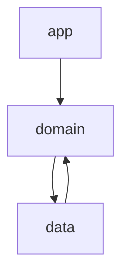

# アーキテクチャ 🏗️

## はじめに 📝

このドキュメントは、プロジェクトのソフトウェアアーキテクチャについて説明します。
[Philosophy](./philosophy.md) に基づいて設計されています。

## アーキテクチャの特徴 🌟

### 概要

主に DDD に影響を受けて設計しています。
次の本や記事が大きく影響を受けています：

- [ドメイン駆動設計 モデリング/実装ガイド](https://little-hands.booth.pm/items/1835632)
- [Flutterアプリにおける、過不足ない設計の考察🎅](https://medium.com/flutter-jp/architecture-240d3c56b597)
- [Omiai の Flutter プロジェクトのアーキテクチャ](https://zenn.dev/omiai_techblog/articles/omiai-flutter-architecture?redirected=1)
- [【Flutter】アプリ全体のアーキテクチャを0から考えて作り直した話](https://zenn.dev/chooyan/articles/eefc76dbd2ba25)
- [Flutter設計パターン入門](https://zenn.dev/flutteruniv/books/flutter-architecture)

### 重視すること

- シンプルである
- 影響範囲が最小限である
- 単体テストを書きやすい
- コードの重複を避ける

## マルチパッケージ構成 📦

本プロジェクトは、マルチパッケージ構成を採用しています。各パッケージの役割は以下の通りです：

### app パッケージ 📱

UI に関する実装を行います。
エントリーポイントとなる `main.dart` や各プラットフォーム特有のディレクトリを含みます。

`lib/` 配下のディレクトリ構造は以下の通りです：

- `core/`: アプリケーション全体で使用される基本的もしくは汎用的な機能を格納します。
  - `app_exception.dart`: アプリケーション固有の例外クラスを定義します。
  - `router/`: ルーティングに関する実装を行います。
  - `util/`: 共通のユーティリティ関数やヘルパークラスを格納します。
- `ui/`: ユーザーインターフェースに関連するコードを格納します。
  - `base_widget/`: アプリケーション全体で使用される基本的なウィジェットを格納します。
  - `component/`: 関心毎にUIコンポーネントを格納します。必要に応じて、 view_model も格納します。
  - `page/`: アプリケーションの各画面を表すウィジェットを格納します。
    - `view_model/`: 画面単位のViewModelを格納します。
  - `dialog/`: ダイアログを格納します。ダイアログは画面のように扱います。
    - `view_model/`: ダイアログ単位のViewModelを格納します。
- `main.dart`: アプリケーションのエントリーポイント

view_model は、 component, page, dialog ごとに作成します。
component については、必要な Widget の分だけ作成します。
page, dialog については、1つの page, もしくは dialog につき1つの view_model を作成します。

page, dialog の view_model は、 page, dialog 全体の状態を管理したり、 page, dialog のライフサイクル起因の処理を実装します。

page, dialog 全体の状態は、各 component の view_model を page, dialog 単位の view_model で監視することで管理します。

ユーザーからのイベント起因の処理は、 component の view_model に実装します。

### common パッケージ 🧰

共通のユーティリティと基本機能を提供します。
他のパッケージから参照されることを想定しています。

`lib/src` 配下のディレクトリ構造は以下の通りです：

- `{関心事}/`: 各関心事に対する実装を格納します。
- `util/`: 共通のユーティリティ機能を格納します。

### domain パッケージ 🔱

ビジネスロジックを含むドメイン層です。関心事ごとに以下を格納します：

- `domain_object`: ドメインオブジェクトを定義します。
- `use_case`: ユースケースを定義します。
- `state`: Riverpod を使い、状態を管理します。

`domain_object` は、 `data`パッケージからの依存を許容しますが、
`use_case`, `state` は、 `data` パッケージからの依存を許容しません。

`domain` パッケージは、 `data` パッケージに依存します。

### data パッケージ 📊

データソースに関する実装を行います。

`data` パッケージは、 `domain` パッケージの `domain_object` に依存します。

外部サービスや外部パッケージとの通信は、 `data` パッケージで行います。

public な関数は Result 型を返します。

## 依存関係 🔗

パッケージ間の依存関係は以下のようになっています：

## 状態管理 🔄

状態管理には Riverpod パッケージを使用します。
各プロバイダーの定義には、 Generator を使用します。

## ルーティング 🗺️

auto_route を使用してルーティングを管理しています。ルート定義は app パッケージの `app_router.dart` で行われています。
