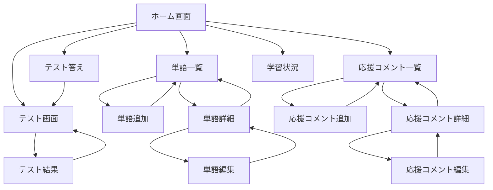

# 画面仕様書

## 画面一覧

- [ホーム](#ホーム画面)
- [テスト設定](#テスト設定画面)
- [テスト](#テスト画面)
- [テスト答え](#テスト答え画面)
- [単語一覧](#単語一覧画面)
- [単語追加](#単語追加画面)
- [単語詳細](#単語詳細画面)（編集、削除ができる）
- [応援コメント一覧](#応援コメント一覧画面)
- [応援コメント追加](#応援コメント追加画面)
- [応援コメント詳細](#応援コメント詳細画面)（編集、削除ができる）
- [学習状況](#学習状況画面)

## 画面遷移図

※ 基本的にホーム画面にはどの画面からも戻れるようにする

## 画面詳細

### ホーム画面

#### 項目定義

| 項目ID | 項目名                 | 種類   | 必須 | 説明                       |
| ------ | ---------------------- | ------ | ---- | -------------------------- |
| H001   | テスト開始ボタン       | button | -    | メインのテスト画面へ遷移   |
| H002   | 単語管理ボタン         | button | -    | 単語一覧画面へ遷移         |
| H003   | 応援コメント管理ボタン | button | -    | 応援コメント一覧画面へ遷移 |
| H004   | テストボタン           | button | -    | テスト画面へ遷移           |
| H005   | 学習状況ボタン         | button | -    | 学習状況画面へ遷移         |

#### イベント定義

| イベントID | イベント名               | 発火条件     | 処理内容                   |
| ---------- | ------------------------ | ------------ | -------------------------- |
| HE001      | テスト開始               | H001クリック | テスト画面へ遷移           |
| HE002      | 単語管理画面表示         | H002クリック | 単語一覧画面へ遷移         |
| HE003      | 応援コメント管理画面表示 | H003クリック | 応援コメント一覧画面へ遷移 |
| HE004      | テスト答え画面表示       | H004クリック | テスト答え画面へ遷移       |
| HE005      | 学習状況画面表示         | H005クリック | 学習状況画面へ遷移         |

### テスト設定画面

#### 項目定義

| 項目ID | 項目名           | 種類     | 必須 | 説明                                    |
| ------ | ---------------- | -------- | ---- | --------------------------------------- |
| TS001  | 出題範囲選択     | dropdown | ○    | 出題範囲の選択方法（番号/ランク/状態）  |
| TS002  | 開始番号         | number   | △    | 番号指定時の開始番号                    |
| TS003  | 終了番号         | number   | △    | 番号指定時の終了番号                    |
| TS004  | ランク選択       | checkbox | △    | ランク指定時の選択（複数可）            |
| TS005  | 状態選択         | checkbox | △    | 状態指定時の選択（未回答/不正解のみ等） |
| TS006  | 問題数設定       | number   | ○    | 1回のテストの問題数                     |
| TS007  | 応援表示頻度     | number   | -    | 何問ごとに応援表示するか（0で非表示）   |
| TS008  | 単語表示色       | color    | -    | 問題の表示色を設定                      |
| TS009  | テスト開始ボタン | button   | -    | 設定を保存してテスト開始                |
| TS010  | キャンセルボタン | button   | -    | 設定を破棄してホームへ                  |

#### イベント定義

| イベントID | イベント名     | 発火条件      | 処理内容                       |
| ---------- | -------------- | ------------- | ------------------------------ |
| TSE001     | 範囲選択変更   | TS001変更時   | 選択に応じた入力項目の表示切替 |
| TSE002     | テスト開始     | TS009クリック | 設定を保存してテスト画面へ遷移 |
| TSE003     | 設定キャンセル | TS010クリック | ホーム画面へ戻る               |

### テスト画面

#### 項目定義

| 項目ID | 項目名       | 種類   | 必須 | 説明                                                         |
| ------ | ------------ | ------ | ---- | ------------------------------------------------------------ |
| T001   | 問題番号     | text   | -    | 問題の番号を表示                                             |
| T002   | 問題文       | text   | -    | 問題文を表示（出題対象とする単語は強調表示する）             |
| T003   | 応援コメント | text   | -    | 設定や学習状況が条件を満たしている場合に、応援コメントを表示 |
| T004   | 答えボタン   | button | -    | テスト答え画面へ遷移                                         |
| T005   | やめるボタン | button | -    | ホーム画面へ戻る                                             |

#### イベント定義

| イベントID | イベント名           | 発火条件     | 処理内容             |
| ---------- | -------------------- | ------------ | -------------------- |
| TE001      | 答えボタンクリック   | T004クリック | テスト答え画面へ遷移 |
| TE002      | やめるボタンクリック | T005クリック | ホーム画面へ戻る     |

### テスト答え画面

#### 項目定義

| 項目ID | 項目名             | 種類   | 必須 | 説明                       |
| ------ | ------------------ | ------ | ---- | -------------------------- |
| R001   | 英単語             | text   | -    | テストの得点を表示         |
| R002   | 日本語訳           | text   | -    | 今回のテストの正答率を表示 |
| R003   | 正誤選択ボタン     | button | -    | 正誤を選択                 |
| R004   | コメント一覧       | text   | -    | 間違えた問題の一覧を表示   |
| R005   | コメント入力       | text   | -    | コメントを入力             |
| R006   | コメント追加ボタン | button | -    | コメントを追加             |
| R007   | 次のテストへボタン | button | -    | 同じ範囲でテストを再実施   |
| R008   | やめるボタン       | button | -    | ホーム画面へ戻る           |

#### イベント定義

| イベントID | イベント名   | 発火条件     | 処理内容                                   |
| ---------- | ------------ | ------------ | ------------------------------------------ |
| RE001      | 正誤選択     | R003クリック | 正誤をDBに保存                             |
| RE002      | コメント追加 | R006クリック | コメントをDBに保存し、コメント一覧を再取得 |
| RE003      | 次のテストへ | R007クリック | テスト画面へ遷移                           |
| RE004      | やめる       | R008クリック | ホーム画面へ戻る                           |

### 単語一覧画面

#### 項目定義

| 項目ID | 項目名           | 種類       | 必須 | 説明                           |
| ------ | ---------------- | ---------- | ---- | ------------------------------ |
| W001   | 検索ボックス     | textbox    | -    | 単語の検索キーワードを入力     |
| W002   | 検索ボタン       | button     | -    | 検索を実行                     |
| W003   | 単語追加ボタン   | button     | -    | 単語追加画面へ遷移             |
| W004   | 単語リスト       | table      | -    | 登録された単語の一覧           |
| W005   | ページネーション | pagination | -    | ページ切り替え用のコントロール |
| W006   | 並び替え選択     | dropdown   | -    | ID順/アルファベット順等の選択  |

#### イベント定義

| イベントID | イベント名       | 発火条件           | 処理内容                     |
| ---------- | ---------------- | ------------------ | ---------------------------- |
| WE001      | 単語検索         | W002クリック       | 検索条件に合う単語を表示     |
| WE002      | 単語追加画面表示 | W003クリック       | 単語追加画面へ遷移           |
| WE003      | 単語詳細表示     | リスト項目クリック | 選択した単語の詳細画面へ遷移 |
| WE004      | ページ切り替え   | W005クリック       | 指定ページの単語を表示       |
| WE005      | リスト並び替え   | W006変更時         | 選択した順序で単語を並び替え |

### 単語追加画面

#### 項目定義

| 項目ID | 項目名           | 種類     | 必須 | 説明                   |
| ------ | ---------------- | -------- | ---- | ---------------------- |
| WA001  | 英単語入力       | textbox  | ○    | 追加する英単語を入力   |
| WA002  | 日本語訳入力     | textbox  | ○    | 英単語の日本語訳を入力 |
| WA003  | 品詞選択         | dropdown | ○    | 単語の品詞を選択       |
| WA004  | 例文入力         | textarea | -    | 使用例の英文を入力     |
| WA005  | 保存ボタン       | button   | -    | 入力内容を保存         |
| WA006  | キャンセルボタン | button   | -    | 単語一覧に戻る         |

#### イベント定義

| イベントID | イベント名     | 発火条件      | 処理内容                   |
| ---------- | -------------- | ------------- | -------------------------- |
| WAE001     | 単語保存       | WA006クリック | 入力内容を検証し、DBに保存 |
| WAE002     | 追加キャンセル | WA007クリック | 単語一覧画面へ戻る         |

### 単語詳細画面

#### 項目定義

| 項目ID | 項目名             | 種類          | 必須 | 説明                                                 |
| ------ | ------------------ | ------------- | ---- | ---------------------------------------------------- |
| WD001  | 英単語表示         | text/textbox  | -    | 英単語を表示。編集モード時はテキストボックスに変化   |
| WD002  | 英単語編集ボタン   | button        | -    | クリックで英単語をテキストボックスに切り替え         |
| WD003  | 日本語訳表示       | text/textbox  | -    | 日本語訳を表示。編集モード時はテキストボックスに変化 |
| WD004  | 日本語訳編集ボタン | button        | -    | クリックで日本語訳をテキストボックスに切り替え       |
| WD005  | 品詞表示           | text/dropdown | -    | 品詞を表示。編集モード時はドロップダウンに変化       |
| WD006  | 品詞編集ボタン     | button        | -    | クリックで品詞をドロップダウンに切り替え             |
| WD007  | 例文表示           | text/textarea | -    | 例文を表示。編集モード時はテキストエリアに変化       |
| WD008  | 例文編集ボタン     | button        | -    | クリックで例文をテキストエリアに切り替え             |
| WD009  | 保存ボタン         | button        | -    | 編集中の項目の変更を保存                             |
| WD010  | キャンセルボタン   | button        | -    | 編集中の項目の変更を破棄                             |
| WD011  | 削除ボタン         | button        | -    | 単語を削除                                           |
| WD012  | コメントリスト     | table         | -    | 単語に対するコメント一覧                             |
| WD013  | コメント入力       | textarea      | -    | 新規コメントを入力                                   |
| WD014  | コメント追加ボタン | button        | -    | コメントを追加                                       |

#### イベント定義

| イベントID | イベント名       | 発火条件      | 処理内容                                                                                   |
| ---------- | ---------------- | ------------- | ------------------------------------------------------------------------------------------ |
| WDE001     | 英単語編集開始   | WD002クリック | 英単語表示をテキストボックスに切り替え                                                     |
| WDE002     | 日本語訳編集開始 | WD004クリック | 日本語訳表示をテキストボックスに切り替え                                                   |
| WDE003     | 品詞編集開始     | WD006クリック | 品詞表示をドロップダウンに切り替え                                                         |
| WDE004     | 例文編集開始     | WD008クリック | 例文表示をテキストエリアに切り替え                                                         |
| WDE005     | メモ編集開始     | WD010クリック | メモ表示をテキストエリアに切り替え                                                         |
| WDE006     | 変更保存         | WD011クリック | 確認用ダイアログを表示する。承認されたら、編集中の項目の変更をDBに保存して表示モードに戻る |
| WDE007     | 編集キャンセル   | WD012クリック | 編集中の項目の変更を破棄し、表示モードに戻る                                               |
| WDE008     | 単語削除         | WD013クリック | 確認後、単語を削除                                                                         |
| WDE009     | コメント追加     | WD016クリック | コメントをDBに保存                                                                         |

### 応援コメント一覧画面

#### 項目定義

| 項目ID | 項目名             | 種類       | 必須 | 説明                           |
| ------ | ------------------ | ---------- | ---- | ------------------------------ |
| C001   | コメント追加ボタン | button     | -    | 新規コメント追加画面へ遷移     |
| C002   | コメントリスト     | table      | -    | 登録された応援コメント一覧     |
| C003   | ページネーション   | pagination | -    | ページ切り替え用のコントロール |
| C004   | 表示条件フィルター | dropdown   | -    | 表示頻度等でフィルター         |

#### イベント定義

| イベントID | イベント名           | 発火条件           | 処理内容                           |
| ---------- | -------------------- | ------------------ | ---------------------------------- |
| CE001      | コメント追加画面表示 | C001クリック       | コメント追加画面へ遷移             |
| CE002      | コメント詳細表示     | リスト項目クリック | コメント詳細画面へ遷移             |
| CE003      | ページ切り替え       | C003クリック       | 指定ページのコメントを表示         |
| CE004      | フィルター適用       | C004変更時         | 選択した条件でコメントをフィルター |

### 応援コメント追加画面

#### 項目定義

| 項目ID | 項目名             | 種類     | 必須 | 説明                         |
| ------ | ------------------ | -------- | ---- | ---------------------------- |
| CA001  | コメント入力       | textarea | ○    | 応援コメントを入力           |
| CA002  | 表示タイミング設定 | dropdown | ○    | いつコメントを表示するか設定 |
| CA003  | 保存ボタン         | button   | -    | 入力内容を保存               |
| CA004  | キャンセルボタン   | button   | -    | コメント一覧に戻る           |

#### イベント定義

| イベントID | イベント名     | 発火条件      | 処理内容                   |
| ---------- | -------------- | ------------- | -------------------------- |
| CAE001     | コメント保存   | CA003クリック | 入力内容を検証し、DBに保存 |
| CAE002     | 追加キャンセル | CA004クリック | コメント一覧画面へ戻る     |

### 応援コメント詳細画面

#### 項目定義

| 項目ID | 項目名                   | 種類          | 必須 | 説明                                                     |
| ------ | ------------------------ | ------------- | ---- | -------------------------------------------------------- |
| CD001  | コメント表示             | text/textarea | -    | コメント内容を表示。編集モード時はテキストエリアに変化   |
| CD002  | コメント編集ボタン       | button        | -    | クリックでコメントをテキストエリアに切り替え             |
| CD003  | 表示タイミング表示       | text/dropdown | -    | 表示タイミングを表示。編集モード時はドロップダウンに変化 |
| CD004  | 表示タイミング編集ボタン | button        | -    | クリックで表示タイミングをドロップダウンに切り替え       |
| CD005  | 保存ボタン               | button        | -    | 編集中の項目の変更を保存                                 |
| CD006  | キャンセルボタン         | button        | -    | 編集中の項目の変更を破棄                                 |
| CD007  | 削除ボタン               | button        | -    | 応援コメントを削除                                       |
| CD008  | 使用履歴リスト           | table         | -    | このコメントが表示された履歴一覧                         |
| CD009  | 作成日時                 | text          | -    | コメントの作成日時を表示                                 |
| CD010  | 更新日時                 | text          | -    | コメントの最終更新日時を表示                             |

#### イベント定義

| イベントID | イベント名             | 発火条件      | 処理内容                                                                                   |
| ---------- | ---------------------- | ------------- | ------------------------------------------------------------------------------------------ |
| CDE001     | コメント編集開始       | CD002クリック | コメント表示をテキストエリアに切り替え                                                     |
| CDE002     | 表示タイミング編集開始 | CD004クリック | 表示タイミング表示をドロップダウンに切り替え                                               |
| CDE003     | 変更保存               | CD005クリック | 確認用ダイアログを表示する。承認されたら、編集中の項目の変更をDBに保存して表示モードに戻る |
| CDE004     | 編集キャンセル         | CD006クリック | 編集中の項目の変更を破棄し、表示モードに戻る                                               |
| CDE005     | コメント削除           | CD007クリック | 確認後、応援コメントを削除                                                                 |

### 学習状況画面

#### 項目定義

| 項目ID | 項目名          | 種類      | 必須 | 説明                             |
| ------ | --------------- | --------- | ---- | -------------------------------- |
| L001   | 期間選択        | daterange | -    | 表示する学習記録の期間を選択     |
| L002   | 正答率グラフ    | chart     | -    | 期間中の正答率推移をグラフ表示   |
| L003   | 学習回数グラフ  | chart     | -    | 期間中の学習回数推移をグラフ表示 |
| L004   | 総学習時間      | text      | -    | 期間中の総学習時間を表示         |
| L005   | 総問題数        | text      | -    | 期間中の総解答数を表示           |
| L006   | 正解数          | text      | -    | 期間中の正解数を表示             |
| L007   | 不正解数        | text      | -    | 期間中の不正解数を表示           |
| L008   | 正答率リセット  | button    | -    | 正答率のリセットを実行           |
| L009   | ユーザー切替    | dropdown  | -    | 他のユーザーの状況を表示         |
| L010   | 詳細データ表    | table     | -    | 日付ごとの詳細データを表示       |
| L011   | CSVエクスポート | button    | -    | 学習記録をCSVでダウンロード      |

#### イベント定義

| イベントID | イベント名     | 発火条件     | 処理内容                     |
| ---------- | -------------- | ------------ | ---------------------------- |
| LE001      | 期間変更       | L001変更時   | 選択期間の学習記録を再表示   |
| LE002      | 正答率リセット | L008クリック | 確認後、正答率をリセット     |
| LE003      | ユーザー切替   | L009変更時   | 選択ユーザーの学習記録を表示 |
| LE004      | CSV出力        | L011クリック | 学習記録をCSVファイルで出力  |
